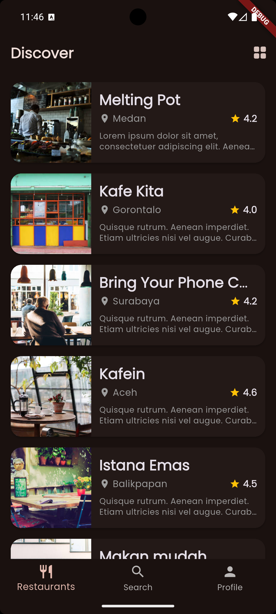
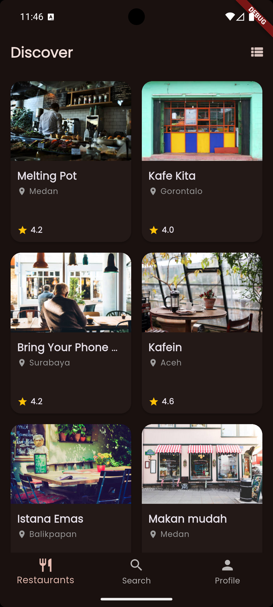
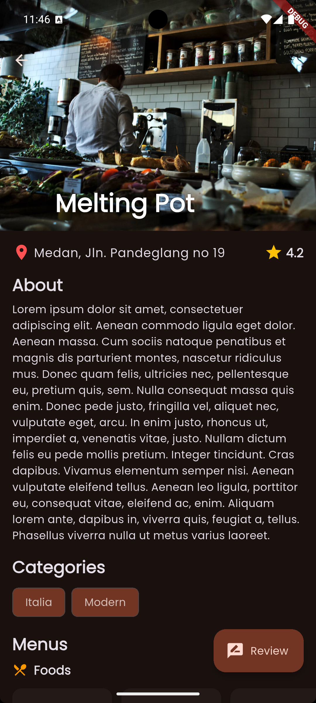
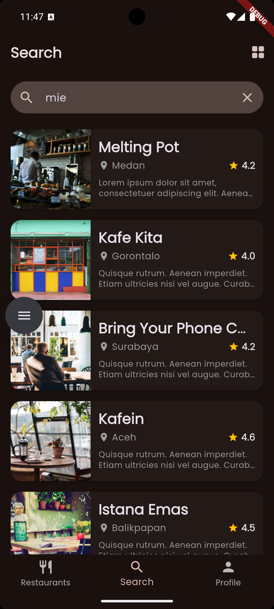
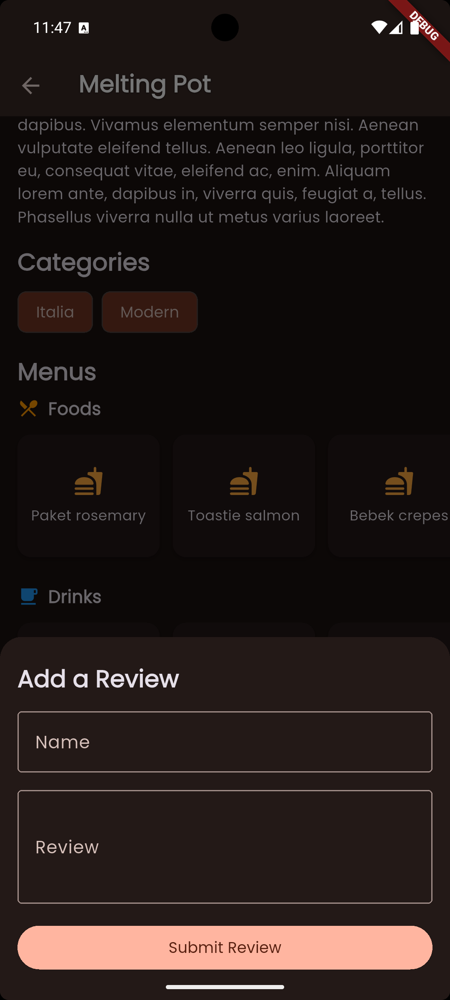

# 🍔 DeltaFood 

A premium Flutter application built to showcase beautiful UI/UX, robust architecture, and seamless API integration. DeltaFood consumes the Dicoding Restaurant API to bring you the best culinary discoveries.

## ✨ Features

- **Dynamic Theming:** Seamlessly adapts to your device's System Theme (Light or Dark Mode) using Material 3 `ColorScheme` and `GoogleFonts.poppins`.
- **Adaptive Layouts:** Instantly toggle between a spacious `GridView` and a compact `ListView` on the Discover and Search screens. Your preference is saved globally!
- **Rich Restaurant Details:** View deep links to menus, customer reviews, and ratings in a gorgeous `SliverAppBar` layout with parallax scrolling and Hero animations.
- **Interactive Review System:** Submit customer reviews via a sleek Bottom Sheet.
- **Advanced Search:** Find restaurants and specific foods quickly with a modern, dynamic search bar complete with contextual empty states.

## 📸 Screenshots

| Discover (List) | Discover (Grid) |
| :---: | :---: |
|  |  |

| Restaurant Details | Search |
| :---: | :---: |
|  |  |

| Add Review | Profile |
| :---: | :---: |
|  |  |

## 🏗️ Architecture

This project follows **Clean Architecture** principles to separate concerns, making the codebase highly testable and maintainable.

- **Domain Layer:** Contains the core business logic, UseCases, and Data Models.
- **Data Layer:** Handles API calls via `RemoteDataSource` and implements Repositories.
- **UI Layer (Presentation):** Utilizes Flutter's built-in `ChangeNotifier` and `ListenableBuilder` for reactive state management.
- **Dependency Injection:** Powered by `get_it` to cleanly manage ViewModels and Repositories as Lazy Singletons and Factories.

## 🚀 Getting Started

To run this project locally, ensure you have the Flutter SDK installed.

1. **Clone the repository**
   ```bash
   git clone https://github.com/yourusername/deltafood.git
   cd deltafood
   ```
2. **Install dependencies**
   ```bash
   flutter pub get
   ```
3. **Run the app**
   ```bash
   flutter run
   ```
